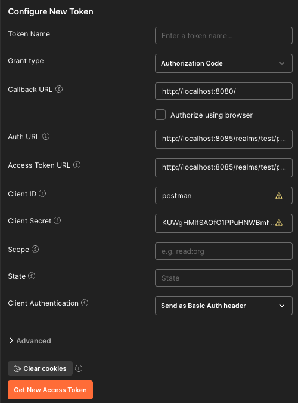

# Spring React KeyCloak

Test di integrazione con Spring, React e KeyCloak

## Avvio servizi con Docker

```bash
docker compose up
```

Dashboard Admin di KeyCloak: http://localhost:8085 (username e password nel file .env)

Verrà creato automaticamente un realm `test`, con client `postman`, `backend` (confidential) e `frontend` (public).
Il realm è stato creato seguendo: https://bootify.io/next-steps/keycloak-configuration-for-spring-boot.html con l'aggiunta di un realm role "ADMIN_ROLE".

Esportare il realm in caso di modifiche: https://www.baeldung.com/spring-boot-keycloak#6-exporting-realms

## Test Postman

Recuperare "Client Secret" del client `postman`: http://localhost:8085/admin/master/console/#/test/clients/ac8c6aa3-db09-4e37-8d43-f0e5429d4e65/credentials

Configurazione realm: http://localhost:8085/realms/test/.well-known/openid-configuration

Dalla Dashboard Admin di KeyCloak creare un utente di test: http://localhost:8085/admin/master/console/#/test/users/add-user

Ad ogni utente è assegnato di default il ruoloe `USER_ROLE`.

Dalla configurazione del realm, recuperare:
- authorization_endpoint (`AUTHORIZATION URL`)
- token_endpoint (`ACCESS TOKEN URL`)

Nel tab "Auth" abilitare OAuth 2.0



Cliccare "Get New Access Token", si aprirà una finestra sulla pagina di login di KeyCloak. Eseguire l'accesso con le credenziali dell'utente di test creato prima. In seguito cliccare su "Use Token".
